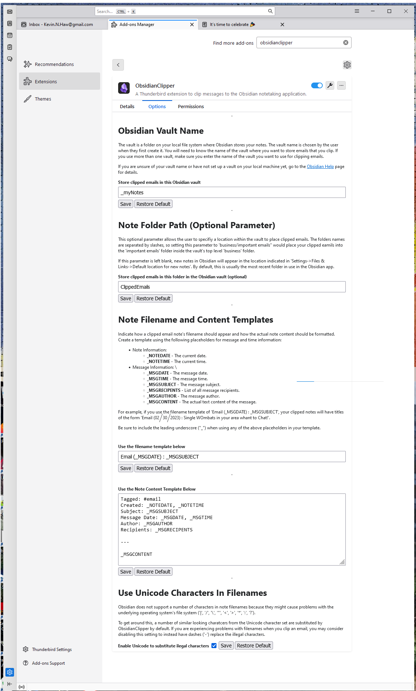
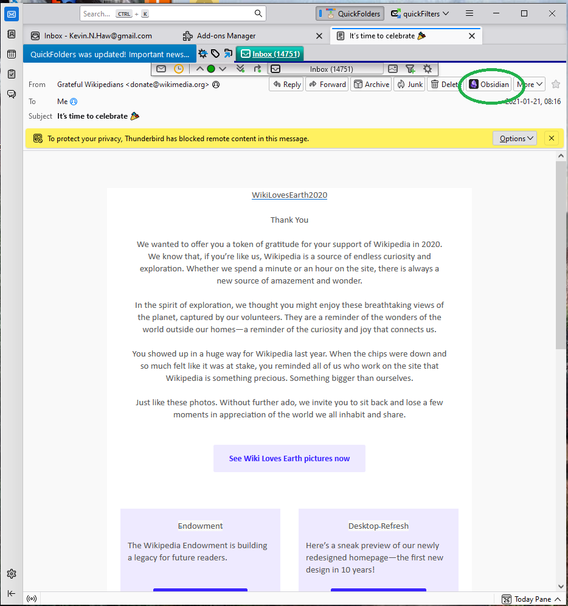
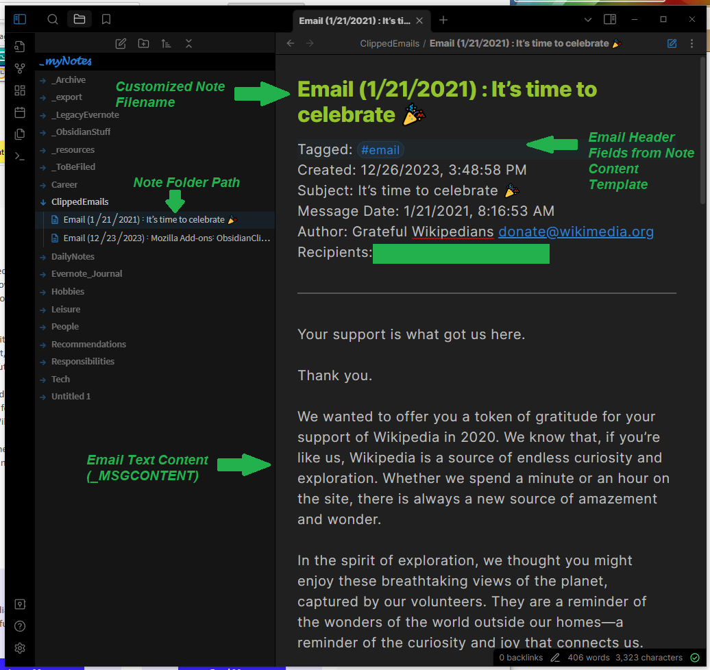
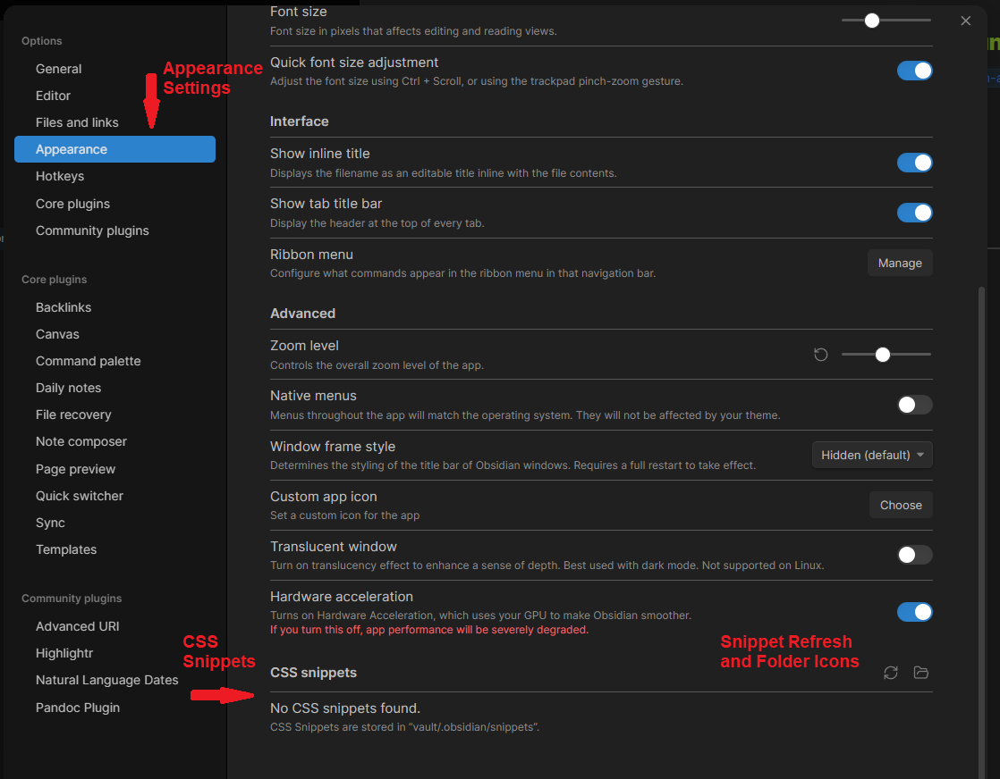
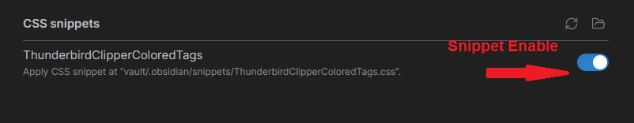

# ThunderbirdObsidianClipper User Guide
ObsidianClipper is an add-on for the Thunderbird email client that lets a user clip messages to the Obsidian notetaking application. You can find out more at the [Thunderbird add-on page](https://addons.thunderbird.net/en-US/thunderbird/addon/obsidianclipper/)
or [at the project GitHub page](https://github.com/KNHaw/ThunderbirdObsidianClipper/).

## Installation
- You will first need to have the Obsidian notetaking app on your local platform as well as the Thunderbird email client.
  - You can download Thunderbird for free [here](https://www.thunderbird.net/en-US/download/).
  - You can download Obsidian for free [here](https://obsidian.md/download).
  - You can install the *Obsidian Clipper* add-on into Thunderbird in two ways:
    - By searching for "ObsdianClipper" in the Add-on mMnager (*Settings->Add-ons Manager*).
    - Or by downloading a file from the [Thunderbird Add-on Site](https://addons.thunderbird.net/en-US/thunderbird/addon/obsidianclipper/), clicking the "Download Now" button to get an XPI file, and installing that file from the add-on manager (*Add-on Manager->Settings->Install Add-on From File*).
- After installing ObsidianClipper to your Thunderbird client, select the Options tab (*Settings->add-ons Manager->Obsidian Clipper->Options tab*) and configure the add-on to work with Obsidian on your machine.
  - *Obsidian Vault Name* - is the name of the vault you created to keep your notes in when you set up Obsidian.
  - *Note Folder Path* - an optional parameter that allows the user to specifiy a location within the
  vault to place clipped emails By default, this will be the folder "ClippedEmails.". If this parameter is left blank, new notes in Obsidian will appear
  in the location indicated in 'Settings->Files & Links->Default location for new notes'.
  - *Note Filename and Content Templates* - allow you to specify how your clipped emails will be formatted and how the files will be named.

- After you've installed and configured the add-on, you're ready to clip emails!

## Usage
To use ObsidianClipper, just select an email and look for the "Obsidian" icon on the header (where you will also find the Reply and Forward buttons). Press the "Obsidian" button and your Obsidian application will launch and load your vault and your email will be clipped into Obsidian. 

Once your email has been clipped, it will look like the screenshot below. By default, your note will be in the top level "ClippedEmails" folder (Obsidian will create the folder if needed), but you can change it with the *Note Folder Path* option mentioned above.

## Add-on Options
There are a number of options that a user can use to configure the clipper add-on. These can be found on the Options tab for the add-on.

- *Obsidian Vault Name* - The vault is a folder on your local file system where Obsidian stores your notes. 
If you are unsure of your vault name or have not set up a vault on your local machine yet, go to the 
[Obsidian Help](https://help.obsidian.md) page for details.
- *Note Folder Path (Optional Parameter)* - Allows the user to specifiy a location within the
  vault to place clipped emails. If this parameter is left blank, new notes in Obsidian will appear
  in the location indicated in 'Settings->Files & Links->Default location for new notes'.
  By default, this is usually the most recent folder in use in the Obsidian app.
- *Note Filename and Content Templates* - These two fields allow a user to specify how notes clipped from emails are named and how 
data is saved in Obsidian by use of placeholders in the text. See the Options tab of the add-on for an up to date list of
supported placeholders.
- *Filename Correction and Disallowed Characters* - these fields detail how the clipper should process characters that might be disallowed by
the Obsidian app or your computer's filesystem.

## Colored Message Tags (Optional Feature)
The *\_MSGTAGSLIST* placeholder in the *Note Content Template* field tells the add-on to insert any 
[category tags](https://support.mozilla.org/en-US/kb/message-tags) 
that are attched to the clipped email by Thuderbird. By leveraging
a powerful feature of Obsidian called [CSS Snippets](https://help.obsidian.md/Extending+Obsidian/CSS+snippets)
it is possible to cusotmize the colors of these message tags. However, this must be done inside Obsidian itself
and not within the Thunderbird add-on.

If you are interested in this feature, follow the steps below:
- In Obsidian, open *Settings*. Then, under *Appearance->CSS snippets*, select Open snippets folder (folder icon).

- In the snippets folder, use Notepad (Windows), gedit (Linux), or another text editor to create a text file
ending in ".css" (for example, ThunderbirdClipperColoredTags.css).
- Back in Thunderbird. open the options for ThunderbirdObsidianClipper (*Settings->add-ons Manager->Obsidian Clipper->Options tab*)
and scroll down to the text box below the "Color Coded Note Tags" section and cut and paste that 
to the CSS snippet file. saving the file.
- Back in Obsidian, under *Appearance->CSS snippets*, select Reload snippets (refresh icon) to see the snippet 
in the list. Then click on the enable switch (right column, under teh folder and refresh icons) to activate the snippet.

You're done! The tags for emails you clip should have matching colors to the tags you use in Thunderbird.
Should you change those colors or add new tags, just redo the process above.

More information can be found about this color tag technique [on this post in the Obsidian Forums](https://forum.obsidian.md/t/markup-tags-inside-html/75810/5).
Thanks to users [ariehen](https://forum.obsidian.md/u/ariehen], [CawlinTeffid](https://forum.obsidian.md/u/CawlinTeffid], [gapmiss](https://forum.obsidian.md/u/gapmiss]
who helped document it.

## Questions? Feedback?
ObsidianClipper is still a work in progress. If you have any questions or want to give me feedback, please reach out to me on the contact links above,
by [filing an issue on GitHub](https://github.com/KNHaw/ThunderbirdObsidianClipper/issues)
or via the contact page on my personal website, [KevinHaw.com](http://www.kevinhaw.com).

I hope this add-on proves useful to you.
