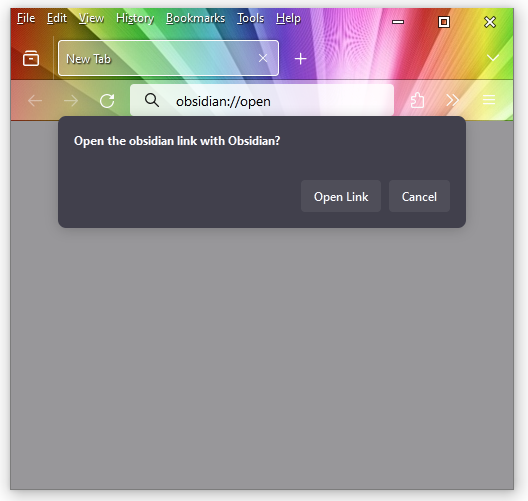
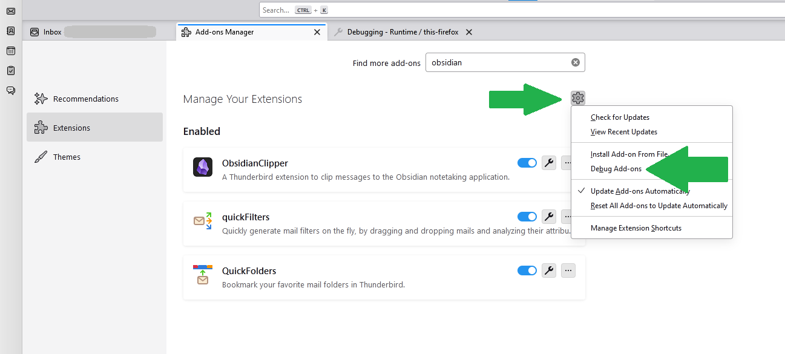
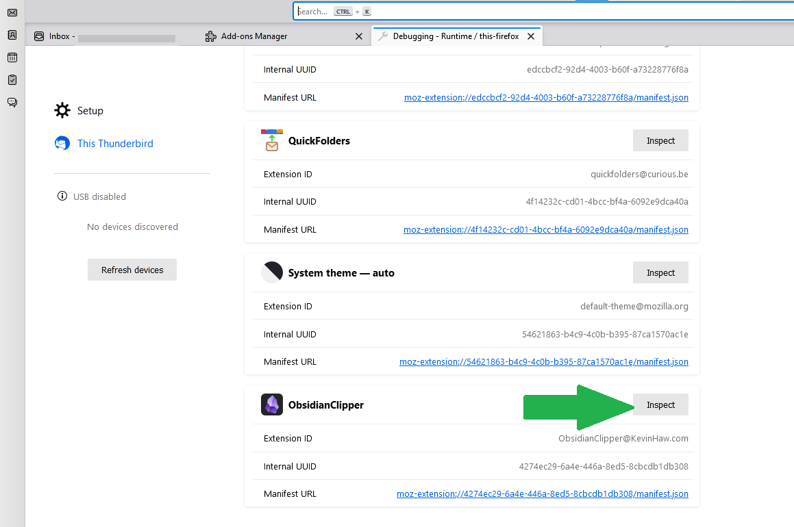

# ThunderbirdObsidianClipper User Guide
ObsidianClipper is an add-on for the Thunderbird email client that lets a user clip messages to the Obsidian notetaking application. You can find out more at the [Thunderbird add-on page](https://addons.thunderbird.net/en-US/thunderbird/addon/obsidianclipper/)
or [at the project GitHub page](https://github.com/KNHaw/ThunderbirdObsidianClipper/).


## Table of Contents
- [Installation](#Installation)
- [Usage](#Usage)
- [Add-on Options](#Add-on-Options)
- [Placeholders](#Placeholders)
- [Obsidian Frontmatter Properties](#Obsidian-Frontmatter-Properties)
- [Colored Message Tags (Optional Feature)](#Colored-Message-Tags-Optional-Feature)
- [Troubleshooting](#Troubleshooting)
- [Questions? Feedback?](#Questions-Feedback)

## Installation
- To use ObsidianClipper, you will first need to have the Obsidian notetaking app on your local platform as well as the Thunderbird email client.
  - You can download Thunderbird for free [here](https://www.thunderbird.net/en-US/download/).
  - You can download Obsidian for free [here](https://obsidian.md/download).
  - You can install the *Obsidian Clipper* add-on into Thunderbird in two ways:
    - By searching for "ObsdianClipper" in the Add-on mMnager (*Settings->Add-ons Manager*).
    - Or by downloading a file from the [Thunderbird Add-on Site](https://addons.thunderbird.net/en-US/thunderbird/addon/obsidianclipper/), clicking the "Download Now" button to get an XPI file, and installing that file from the add-on manager (*Add-on Manager->Settings->Install Add-on From File*).
- After installing ObsidianClipper to your Thunderbird client, select the Options tab (*Settings->add-ons Manager->Obsidian Clipper->Options tab*) and configure the add-on to work with Obsidian on your machine.
  - *Obsidian Vault Name* - is the name of the vault you created to keep your notes in when you set up Obsidian.
  - *Note Folder Path* - an optional parameter that allows the user to specifiy a location within the
  vault to place clipped emails By default, this will be the folder "ClippedEmails.". If this parameter is left blank, new notes in Obsidian will appear
  in the location indicated in 'Settings->Files & Links->Default location for new notes'.
  - *Note Filename and Content Templates* - allow you to specify how your clipped emails will be formatted and how the files will be named.


- After you've installed and configured the add-on, you're ready to clip emails!

## Usage
To use ObsidianClipper, just select an email and look for the "Obsidian" icon on the header (where you will also find the Reply and Forward buttons). Press the "Obsidian" button and your Obsidian application will launch and load your vault and your email will be clipped into Obsidian. If you only want to clip a portion of the email, select the desired text before clicking on the Obsidian icon.


Once your email has been clipped, it will look like the screenshot below. By default, your note will be in the top level "ClippedEmails" folder (Obsidian will create the folder if needed), but you can change it with the *Note Folder Path* option mentioned above.


## Add-on Options
There are a number of options that a user can use to configure the clipper add-on. These can be found on the Options tab for the add-on.

- *Obsidian Vault Name* - The vault is a folder on your local file system where Obsidian stores your notes. 
If you are unsure of your vault name or have not set up a vault on your local machine yet, go to the 
[Obsidian Help](https://help.obsidian.md) page for details.
- *Note Folder Path (Optional Parameter)* - Allows the user to specifiy a location within the
  vault to place clipped emails. If this parameter is left blank, new notes in Obsidian will appear
  in the location indicated in 'Settings->Files & Links->Default location for new notes'.
  By default, this is usually the most recent folder in use in the Obsidian app.
- *Note Filename and Content Templates* - These two fields allow a user to specify how notes clipped from emails are named and how 
  data is saved in Obsidian by use of placeholders in the text. See the Options tab of the add-on for a brief rundown of the
  different placeholder fields or the [Placeholders](#Placeholders) section of this guide for the definitive list of
  supported placeholders.
- *Filename Correction and Disallowed Characters* - these fields detail how the clipper should process characters that might be disallowed by
the Obsidian app or your computer's filesystem.
- *Color Coded Note Tags (Optional Feature)* - This field is detailed in the [section below of the same name](#Colored-Message-Tags-Optional-Feature).


## Placeholders
Message specific information can be inserted into a note by putting "placeholders" into the *Filename Template* and *Note Content Template* fields in the options tab.
These placeholders and what is substituted in the clipped note are detailed below:
- *_NOTEDATE* - The current date. Fields from the note date are inserted with these other symbols:
    - *_NOTEYEAR* for a 4 digit year, *_NOTEMONTH* for a 01-12 month, or *_NOTEDAY* for a 00-31 day of the month.
- *_NOTETIME* - The current time. Fields from the note time are inserted with these symbols:
    - *_NOtheOUR* for the 00-23 hour, *_NOTEMIN* for a 00-59 minute, or *_NOTESEC* for a 00-59 second.
- *_MSGDATE* - The message date. Fields from the message date are inserted with these other symbols:
    - *_MSGYEAR* for a 4 digit year, *_MSGMONTH* for a 01-12 month, or *_MSGDAY* for a 00-31 day of the month.
- *_MSGTIME* - The message time. Fields from the message time are inserted with these symbols:
    - *_MSGHOUR* for the 00-23 hour, *_MSGMIN* for a 00-59 minute, or *_MSGSEC* for a 00-59 second.
- *_MSGSUBJECT* - The message subject.
- *_MSGRECIPENTS* - List of all message recipients (in the email "to" field).
    - Similarly, *_MSGCC* will list the addresses from the "cc" field and *_MSGBCC* will list the addresses from "bcc"
    - Additionally, the *_MSGRECIPENTS_YAML*, *_MSGCC_YAML*, and *_MSGBCC_YAML* placeholders provide the same data in a 
        format that can be used in Obsidian [frontmatter properties](https://help.obsidian.md/Editing+and+formatting/Properties).
        See the [Obsidian Frontmatter Properties](#Obsidian-Frontmatter-Properties) section below for an example.
- *_MSGAUTHOR* - The message author.
- *_MSGTAGSLIST* - Include [Email catagory tags](https://support.mozilla.org/en-US/kb/message-tags) in a hashtag spaced list. See below for color coding options.
- *_MSGIDURI* - A URI that can be clicked to open the message.
    - For example, the text \"`[click here to open](_MSGURI)`\" will create a link in your note that when clicked will open the email in your client.
- *_MSGCONTENT* - The actual text content of the message.
    
  
## Obsidian Frontmatter Properties
It is possible set the *Note Content Template* field to embed Obsidian [frontmatter properties](https://help.obsidian.md/Editing+and+formatting/Properties) into a clipped
note by inserting a label and content between two \"`---`\" markdown lines. These allow the Obsidian database to be searched in a more efficient and powerful way.

The *_MSGRECIPENTS_YAML*, *_MSGCC_YAML*, and *_MSGBCC_YAML* placeholders provide lists of data that are formatted specifically to support this feature.

Should you choose to use these features of Obsidian, here is a sample YAML header you may want to place at the top of your Note Content Template:

```
---
Note Created: _NOTEDATE, _NOTETIME
Message Subject: _MSGSUBJECT
Message Date: _MSGDATE, _MSGTIME
Message Author: _MSGAUTHOR
Message Recipients: _MSGRECIPENTS_YAML
CC: _MSGCC_YAML
BCC: _MSGBCC_YAML
---
```


## Colored Message Tags (Optional Feature)
The *\_MSGTAGSLIST* placeholder in the *Note Content Template* field tells the add-on to insert any 
[category tags](https://support.mozilla.org/en-US/kb/message-tags) 
that are attched to the clipped email by Thuderbird. By leveraging
a powerful feature of Obsidian called [CSS Snippets](https://help.obsidian.md/Extending+Obsidian/CSS+snippets)
it is possible to cusotmize the colors of these message tags. However, this must be done inside Obsidian itself
and not within the Thunderbird add-on.

If you are interested in this feature, follow the steps below:
- In Obsidian, open *Settings*. Then, under *Appearance->CSS snippets*, select Open snippets folder (folder icon).


- In the snippets folder, use Notepad (Windows), gedit (Linux), or another text editor to create a text file
ending in ".css" (for example, ThunderbirdClipperColoredTags.css).
- Back in Thunderbird. open the options for ThunderbirdObsidianClipper (*Settings->add-ons Manager->Obsidian Clipper->Options tab*)
and scroll down to the text box below the "Color Coded Note Tags" section and cut and paste that 
to the CSS snippet file. saving the file.
- Back in Obsidian, under *Appearance->CSS snippets*, select Reload snippets (refresh icon) to see the snippet 
in the list. Then click on the enable switch (right column, under the folder and refresh icons) to activate the snippet.


You're done! The tags for emails you clip should have matching colors to the tags you use in Thunderbird.
Should you change those colors or add new tags, just redo the process above.

More information can be found about this color tag technique [on this post in the Obsidian Forums](https://forum.obsidian.md/t/markup-tags-inside-html/75810/5).
Thanks to users [ariehen](https://forum.obsidian.md/u/ariehen), [CawlinTeffid](https://forum.obsidian.md/u/CawlinTeffid), and [gapmiss](https://forum.obsidian.md/u/gapmiss)
who helped document it.

## Troubleshooting
If ObsidianClipper is not working for you, please take a moment to reread the instructions and reinstall the add-on. You might also consider reinstalling Obsidian on your computer as well.

If that does not work, please try some of the steps below.

### Obsidian Does Not open
If you clip a note and Obsidian does not open, it's possible you are having a problem with the Obsidian URI schema. The [Obsidian website](https://help.obsidian.md/Extending+Obsidian/Obsidian+URI) does
a good job of explaining it, but the important thing to understand is that ObsidianClipper uses links of the form `obsidian://<some stuff>` in order to write notes to Obsidian.
A good way to test this is to open a web browser on your machine, type in `obsidian://open`, and press return. You're supposed to get a prompt asking you 
if you want to open the link with Obsidian as seen below.



If you do not see a prompt like the one above then the Obsidian URI sheme is not working on your machine. If this is occurring,
please try one of the following. 

- In Linux, it has been seen that 
[using AppImage to install Obsidian](https://github.com/KNHaw/ThunderbirdObsidianClipper/issues/2) can cause a problem. If your Obsidian
installation was via AppImage, try uninstalling it and reinstalling it with Deb.
    - Thanks to [sevadah](https://github.com/sevadah) and [Massimo Bianchetto](https://github.com/mbianchetto) for helping out with this issue!
- The [Obsdian website has a procedure for registering the Obsidian URI](https://help.obsidian.md/Extending+Obsidian/Obsidian+URI#Register+Obsidian+URI). 
You may wish to give that a try as well.
- There is documentation claiming that Linux requires a special setup procedure such as the one 
[here](https://amir.rachum.com/obsidian-uri-linux/) (note that the development team has not tried this out - please let us know how it works
via the feedback links below).
- If you are having problems in Windows or MacIntosh, please let us know and we can try to fix the issue. 

Similarly, if you resolve this issue on your own 
please reach out to our team so we can post a solution here for future users.

### Obsidian Vault Problems
If you clip an email and see a "Vault Not Found" error, the *Obsidian Vault Name* field is not set properly. If you are unsure of your 
vault name or have not set up a vault on your local machine yet, go to the [Obsidian Help](https://help.obsidian.md) page for details.

### Unable to Save Email Attachments
Currently, the add-on does not support saving mail attachments. However, multiple users have requested this feature and an [issue 
on GitHub](https://github.com/KNHaw/ThunderbirdObsidianClipper/issues/9) is being used to track progress.

The current plan is to support HTML email attachments at some point in April 2024. Please watch the issue link above for status.

### Blank Note Content
First, there is currently a [limitation](https://github.com/KNHaw/ThunderbirdObsidianClipper/issues/13) that HTML mail 
(those with pictures or links or text formatting like bold or italic) may not clip correctly. If your selected emails 
are HMTL, this could be happening. To rule this problem out, create a simple one line test email with plain text ("Hello, world!"), 
send it to yourself, and see if it clips correctly.

The current plan is to support HTML email at some point in the first half of 2024. Please watch the issue link above for status.


### Note Content Corrupted or Missing
If you do not see the expected content in a note that has been clipped, look at the *Note Content Template* field in the options menu
and make sure that the *_MSGCONTENT* placeholder is present. If is isn't, the body of your email will not be clipped.

If this happens, insert the *_MSGCONTENT* placeholder into the *Note Content Template* field and save it 
or use the "Restore Default" button to go back to a known, good baseline.

### Capturing a Debug Log
If you have tried the above and have not fixed your problem, you should capture a debug log and send it to the development team via the feedback links below.
Just be sure to remove any sensitive information such as email addresses before sending in debug data.

#### Capturing a Debug Log- Step 1
From the Settings menu, select "Add On manager." Then click on the gear tab there and select "Debug Add-ons"



#### Capturing a Debug Log - Step 2
From the Debug tab, scroll down to Obsidian Clipper and click the "Inspect" button.



#### Capturing a Debug Log - Step 3
You will see the debug console launch in a new window. Back in Thunderbird, select an email and try to clip it 
(please pick a test email that does not have sensitive information). 
You should see some text appear on the console log (lower right corner). Right click on any of that text and select "Copy All Messages." 
This will put the log into the clipboard, which you can then put in the notepad application or place in an email back to the development team.


## Questions? Feedback?
ObsidianClipper is still a work in progress. If you have any questions or want to give me feedback, please reach out to to the team
by [filing an issue on GitHub](https://github.com/KNHaw/ThunderbirdObsidianClipper/issues), via the "Support Email" link on the
[Thunderbird add-on page](https://addons.thunderbird.net/en-US/thunderbird/addon/obsidianclipper/), 
or via the contact page on my personal website, [KevinHaw.com](http://www.kevinhaw.com).

If sending screenshots for a bug report or via email, make sure to blur or mark out any sensitive information such as email addresses since the images may be accessible to the wider internet.

I hope this add-on proves useful to you.
